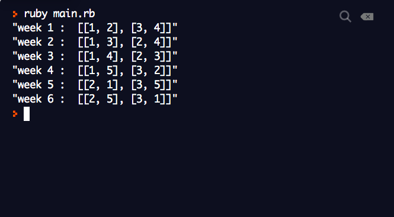
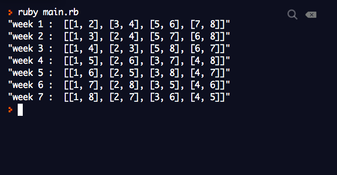
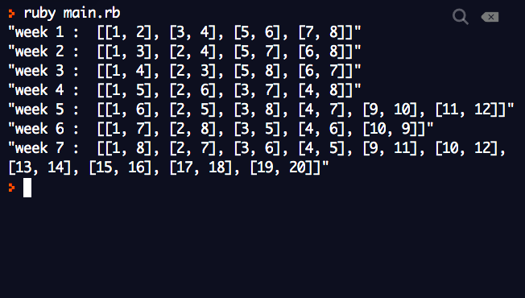
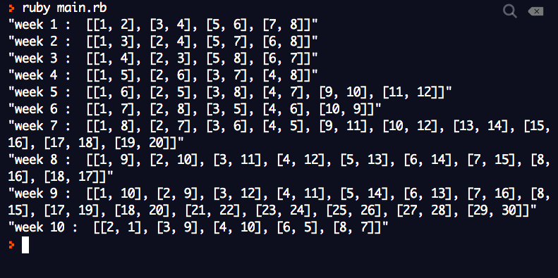
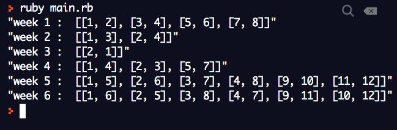
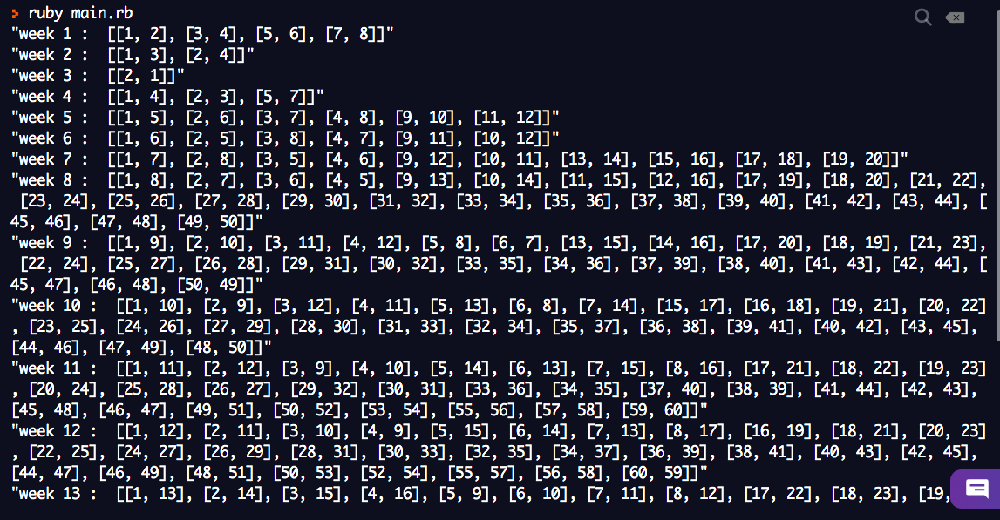

<h1 align=center> **Pairing Problem coding challenge ** </h1>

### Problem:

A class consisting of n students whom I'd like to pair up throughout the school year.

The number of pairs is n/2. I'd like to maximise students pairing with new people as much as possible, and to exhaust all possible combinations. Permutations don't matter -- student 1 + student 2 is same as student 2 + student 1. Pairing happens once a week. No 2 people should meet with each other again until they have met everyone else. Also, the number of students keep changing every week

## Simple Usecase

## Input

`[8, 8, 8, 8, 8, 8, 8]`

*What this means is that there are 8 students in the class, i.e `n = 8` every week.*

### Output

week 1: [[1, 2], [3, 4], [5, 6], [7, 8]]

week 2: [[1, 3], [2, 4], [5, 7], [6, 8]]
week 3: [[1, 4], [2, 3], [5, 8], [6, 7]]
week 4: [[1, 5], [2, 6], [3, 7], [4, 8]]
week 5: [[1, 6], [2, 5], [3, 8], [4, 7]]
week 6: [[1, 7], [2, 8], [3, 5], [4, 6]]
week 7: [[1, 8], [2, 7], [3, 6], [4, 5]]

## When students count changes

### Input

`[4, 5, 5, 5, 5, 5 ]`

On week 2, a new student joined the class. All other weeks remain the same as week 2

### Output

week 1: [[1, 2], [3, 4]]
week 2: [[1, 3], [2, 5]]
week 3: [[2, 3], [4, 5]]
week 4: [[1, 4], [3, 5]]
week 5: [[1, 5], [2, 4]]
week 6: [[1, 2], [3, 4]]

### Test Cases
- input:  [4, 5, 5, 5, 5, 5 ]

- [8, 8, 8, 8, 8, 8, 8]

- input:  [8, 8, 8, 8, 12, 10, 20]

- input: [8, 8, 8, 8, 12, 10, 20, 18, 30, 10]

- input: [9, 5, 2, 7, 12, 13]

- input: [9, 5, 2, 7, 12, 13,20,50,50,50,60,60,50,70,100]
